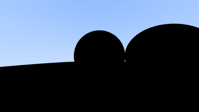

# v_raytracing

Following _Ray Tracing in One Weeked_, but doing it in VLang!

Fixed the error in the previous push, I had one match statement that wasn't returning anything so it made everything dark where an object was intersected

This was supposed to add basic refraction, but something seems to have broken. I will continue to work on it.